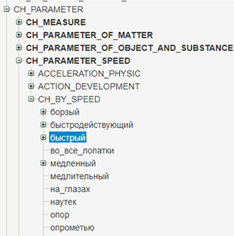
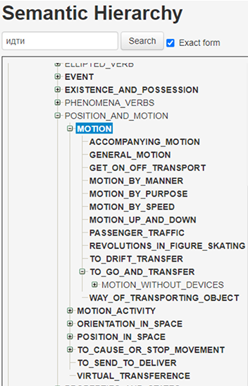

[Русский](README_detailed_description_RU.md)

# Contents
1. [Dataset](#dataset)
2. [Corpus Markup](#corpus-markup)
3. [The Semantic Hierarchy](#the-semantic-hierarchy)
3. [The conversion of the Compreno markup in the UD format](#the-conversion-of-the-compreno-markup-in-the-ud-format)<br />
4.1 [Tokenization](#tokenization )<br />
4.2 [The conversion of parts of speech and grammatical features](#the-conversion-of-parts-of-speech-and-grammatical-features)<br />
4.3 [The conversion of the syntactic heads](#the-conversion-of-the-syntactic-heads)<br />
4.4 [The conversion of the dependent constituents](#the-conversion-of-the-dependent-constituents)<br />
5. [Main problems and their solutions](#main-problems-and-their-solutions)

# Dataset
Our corpus consists of news from the [NewsRu.Com](https://abbyyihq-my.sharepoint.com/:u:/g/personal/vladimir_dobrovolskiy_abbyy_com/EfDkvviTivNCjWVkL7WhfeIBSnZdz0yRhssDbGOjHm2kpA?e=CiDK8x) dataset, created during building the [RuCoCo](https://github.com/vdobrovolskii/rucoco) corpus &ndash; the corpus with the coreference annotation.

The SEMarkup corpus includes ~400,000 tokens, divided into two parts:

- ~360,000 training and validation sample, 
- ~40,000 etalon sample for quality evaluation.

The dataset contains 3 markup levels:

- morphological,
- syntactic,
- semantic.

We have chosen the UD markup format as the one which seems the most popular now, however, it does not suggest semantic information. Full semantic markup can be found in the Compreno markup format, which includes word meanings (defined in terms of semantic classes &ndash; semantic fields, provided for each word meaning), and semantic relations between them (which as marked as deeps slots, or semantic roles).

To obtain the corpus in the UD format enriched by the semantic markup, we have organized the project pipeline as follows. 


# Corpus Markup

At the first stage, the corpus was annotated with the Compreno semantic markup: we obtained the markup automatically with the help of the Compreno parser and checked it manually afterwards. Nevertheless, the number of categories in the full Compreno markup is rather big: more than 200,000 semantic classes and more than 330 semantic roles, which seems too much both for the machine learning of the semantic parsers on the dataset of the given volume and for a number of application tasks the corpus can be used for.

To make the formalism simpler, we decided to use so-called generalized semantic classes, which denote not exactly the meaning of a word but are hyperonyms for larger word classes. For instance, all words with motion semantics belong to the hyperonym class MOTION, and all words denoting humans &ndash; in the semantic class HUMAN.

More than that, we reduced the number of the semantic roles. For example, full Compreno markup suggests different roles for different characteristic dependencies (that is, weight, speed, size, and so on). In the generalized variant, all such characteristics correspond to one characteristical role. Or, the Compreno model has several slots for temporal relations: Time (‘вчера &ndash; yesterday, через два дня &ndash; in two days’), Time\_Situation (‘когда все приедут &ndash; when everybody comes’), Time\_Being (‘при Иване Грозном &ndash; in times of Ivan the Terrible’). In the generalized presentation, all these roles correspond to only one Time slot.

As a result, the number of the hyperonym semantic classes used in the markup was reduced to 1085 classes, and the number of the semantic roles &ndash; to 143 slots.
Among the materials proposed for the competition the following data are available:


- full [list of the semantic roles used in the markup](https://github.com/dialogue-evaluation/SEMarkup-2023/blob/main/tagsets/semantic_slots.xlsx) with comments and examples;
- [table of hyperonym semantic classes](https://github.com/dialogue-evaluation/SEMarkup-2023/blob/main/tagsets/semantic_classes.csv).

# The Semantic Hierarchy

The [semantic hierarchy](https://int.webcorpora.ru/spring2/semantics/) is organized in the form of the tree, which consists of the semantic classes (SCs) printed in capitals &ndash; the SCs are universal for all languages included in the hierarchy and denote semantic senses common for all languages. The classes can be opened by pressing the Plus sign to the left of the class. 

In the Compreno model, each SC contains lexical classes (LCs) &ndash; lexicon of different languages, which are written in small letters:



Here we have presented a shortened version of the hierarchy: one can see only the hyperonym SCs, which are shown in the generalized version of the semantic markup:



The hyperonym SCs are printed with bold letters in the tree.
The hierarchy is provided with the search option. One can search for both exact and partial correspondences using the ‘Exact form’ checkbox. The picture below shows the SH tree to the left and the search results to the right. Click on each class in the search results will open the class in the hierarchy tree:


# The conversion of the Compreno markup in the UD format

The Compreno markup looks as follows. The boundaries of the constituents are marked with square brackets which are put around the dependent nodes. Each token is provided with both its semantic class and the semantic relation with its head:

>Обычно бюджет ко второму чтению готовится непосредственно в Думе: депутаты корректируют правительственные планы.
>‘Usually the budget is prepared for the second reading directly in the Duma: the deputies update the government plans.’


>[[Time: Обычно"обычно:#frequentative\_adverbs\_adj:FREQUENTATIVE"] [Experiencer\_Metaphoric: бюджет"бюджет:бюджет:BUDGET"] [[ко"к:#preposition:PREPOSITION"] [OrderInTimeAndSpace: второму"второй:TWO\_ORDINAL"] Object\_Situation: чтению "чтение:READING\_OF\_THE\_DRAFT\_LAW"] Predicate: готовится"готовить:готовить:PREPAREDNESS" [[DegreeApproximative: непосредственно"непосредственный:DIRECT\_OBLIQUE"] [в"в\_Prepositional:#preposition:PREPOSITION"] Locative: Думе"дума:дума:DUMA"]#: [[Agent: депутаты"депутат:депутат:DEPUTY"] Specification\_Clause: корректируют"корректировать:корректировать:TO\_CORRECT" [[Agent: правительственные"правительство:правительство:GOVERNMENT"] Object\_Situation: планы"план:план:SCHEDULE\_FOR\_ACTIVITY"]]].


The markup can also be provided with surface, or syntactic, roles, coreference and non-tree links, however, the purpose of the given dataset was only the semantic markup. The only surface slot mentioned in the markup is the $Dislocation slot (the $ sign denotes surface slots in the model) &ndash; it is the slot for the dislocated constituents (dislocated constituents are the ones that syntactically depend on one core, while semantically &ndash; on the other core).

Unlike the UD format, the bracket format does not allow one to indicate morphological information in the markup, that is, parts of speech and grammatical features. Nevertheless, this information is available as well: the Compreno parser builds the parsing trees for the sentences, where each node is provided with full grammatical and semantic information, namely, morphological and syntactic features (grammemes), syntactic and semantic relations, semantic classes, non-tree links, and so on:


As an illustration, let us show the morphological grammemes for the node `"готовить:готовить:PREPAREDNESS"`:


During the conversion of the Compreno markup into the UD format, all the necessary information is taken from the parsing trees. After it, the markup looks as follows:

```
# text = На месте погибли 25 &ndash; летний Тато Карепов , 43 &ndash; летняя Наталья Карепова и 60 &ndash; летняя Шура Таанани.
1	На	на	ADP	_	_	2	case	_	PREPOSITION
2	месте	место	NOUN	_	Animacy=Inan|Case=Loc|Gender=Neut|Number=Sing	3	obl	Locative	PLACE
3	погибли	погибнуть	VERB	_	Aspect=Perf|Mood=Ind|Number=Plur|Tense=Past|VerbForm=Fin|Voice=Act	0	root	Predicate	PHYSICAL_PSYCHIC_CONDITION
4	25-летний	25-летний	ADJ	_	Case=Nom|Degree=Pos|Gender=Masc|Number=Sing	5	amod	Time	UNIT_OF_TIME
5	Тато	Тато	PROPN	_	Animacy=Anim|Case=Nom|Gender=Fem|Number=Sing	3	nsubj	Experiencer	BEING
6	Карепов	Карепов	PROPN	_	Animacy=Anim|Case=Nom|Gender=Fem|Number=Sing	5	flat:name	Name_Title	BEING
7	,	,	PUNCT	_	_	3	punct	_	_
8	43-летняя	43-летний	ADJ	_	Case=Nom|Degree=Pos|Gender=Fem|Number=Sing	9	amod	Time	UNIT_OF_TIME
9	Наталья	Наталья	PROPN	_	Animacy=Anim|Case=Nom|Gender=Fem|Number=Sing	5	conj	Experiencer	BEING
10	Карепова	Карепова	PROPN	_	Animacy=Anim|Case=Nom|Gender=Fem|Number=Sing	9	flat:name	Name_Title	_
11	и	и	CCONJ	_	_	13	cc	_	COORDINATING_CONJUNCTIONS
12	60-летняя	60-летний	ADJ	_	Case=Nom|Degree=Pos|Gender=Fem|Number=Sing	13	amod	Time	UNIT_OF_TIME
13	Шура	Шура	PROPN	_	Animacy=Anim|Case=Nom|Gender=Fem|Number=Sing	5	conj	Experiencer	BEING
14	Таанани	Таанани	PROPN	_	Animacy=Anim|Case=Nom|Gender=Fem|Number=Sing	13	flat:name	Name_Title	BEING
15	.	.	PUNCT	_	_	3	punct	_	_
```

The final UD-markup includes three levels: morphological, syntactic, and semantic. The UD presentation has its own morphology and syntax, therefore, the corresponding information in the Compreno model is converted into the UD format. As far as the semantic relations are concerned, the UD format does not have the semantic level, so the information about the SCs and the deep slots is added to the UD markup in the way it is presented in Compreno.

Now let us examine the conversion of morphology and syntax in more detail.

## Tokenization 
**Dividing**

Unlike the UD format, Compreno has so called non-morphological lexemes, such as ‘в частности &ndash; particularly’, ‘кроме того &ndash; besides’, ‘как бы то ни было &ndash; anyway’, and so on. The thing is that these elements include the space in their body. To convert such elements into the UD format, one has to divide them into separate parts with the help of the special script. It entails the additional work on providing them with part of speech tags and the semantic and syntactic dependencies.

**Merging**

In most cases, the Compreno model treats parts of composite words as separate tokens. It concerns words like ‘торпедообразный &ndash; torpedo-like’ (‘торпедо &ndash; torpedo’ + ‘образный &ndash; like’), ‘антиреволюционный &ndash; anti-revolutionary’ (‘анти &ndash; anti’ + ‘революционный &ndash; revolutionary’), names with numbers (‘Ту-104’), or ordinal numbers written with combinations of a number and its grammatical inflection (‘10-й день &ndash; 10th day’). Such cases are joined in one UD token with the help of the script.

## The conversion of parts of speech and grammatical features

One can see the information on parts of speech, grammatical categories and features in the [description of the tagset for the GramEval-2020 competition](https://github.com/dialogue-evaluation/GramEval2020/blob/master/UDtagset/UD-Russian_tagset.md).

## The conversion of the syntactic heads

The syntactic heads are converted into the UD format from the bracket Compreno format. The heads for the punctuation marks are assigned through a special algorithm. In most cases, the syntactic and the semantic heads coincide:

>Это означает фактическую отмену запрета на поставки нефти, введенного Ираком 1 декабря.
>‘It means actual cancellation of the prohibition on oil delivery introduced by Iraq on December 1.’


>#[[Relation\_Relative: Это"это:demonstrative\_pronouns:PRONOUNS"] Predicate: означает"означать:TO\_SIGNIFY" [[Modality: фактическую"фактический:фактический:FACTUAL"] Relation\_Correlative: отмену"отменять:отменять:TO\_CANCEL" [Object\_CreationDestruction: запрета"запрет:PROHIBITION" [[на"на\_Accusative:#preposition:PREPOSITION"] Purpose\_Goal: поставки"поставлять:поставлять:TO\_PROVIDE\_COMMODITIES" [Object: нефти"нефть:MINERAL\_OIL"]], [ParticipleRelativeClause: введенного"ввести:TO\_INTRODUCE\_AS\_APPLY" [Agent: Ираком"Ирак:IRAQ"] [Time: 1"#day\_number:DAY\_NUMBER" [Time: декабря"декабрь:декабрь:DECEMBER"]]]]]].

```
# text = Это означает фактическую отмену запрета на поставки нефти, введенного Ираком 1 декабря.
1	Это	это	PRON	_	Animacy=Inan|Case=Nom|Gender=Neut|Number=Sing|Person=3	2	nsubj	Relative	PRONOUNS_INANIMATE
2	означает	означать	VERB	Aspect=Imp|Mood=Ind|Number=Sing|Person=3|Tense=Pres|VerbForm=Fin|Voice=Act	0	root	Predicate	TO_MEAN
3	фактическую	фактический	ADJ	_	Case=Acc|Degree=Pos|Gender=Fem|Number=Sing	4	amod	Characteristic	MODALITY
4	отмену	отмена	NOUN	_	Animacy=Inan|Case=Acc|Gender=Fem|Number=Sing	2	obj	Correlative	TO_CANCEL
5	запрета	запрет	NOUN	_	Animacy=Inan|Case=Gen|Gender=Masc|Number=Sing	4	nmod	Object	RESULTS_OF_GIVING_INFORMATION_AND_SPEECH_ACTIVITY
6	на	на	ADP	_	_	7	case	_	PREPOSITION
7	поставки	поставка	NOUN	_	Animacy=Inan|Case=Acc|Gender=Fem|Number=Plur	5	nmod	Purpose	TO_GIVE
8	нефти	нефть	NOUN	_	Animacy=Inan|Case=Gen|Gender=Fem|Number=Sing	7	nmod	Object	NATURAL_SUBSTANCE
9	,	,	PUNCT	_	_	10	punct	_	_
10	введенного	ввести	VERBAspect=Perf|Case=Gen|Gender=Masc|Number=Sing|Tense=Past|VerbForm=Part|Voice=Pass	5	acl	ParticipleRelativeClause	TO_APPLY
11	Ираком	Ирак	PROPN	_	Animacy=Inan|Case=Ins|Gender=Masc|Number=Sing	10	obl:agent	Agent	COUNTRY_AS_ADMINISTRATIVE_UNIT
12	1	1	NUM	_	Case=Gen	10	obl	Time	DATE
13	декабря	декабрь	NOUN	_	Animacy=Inan|Case=Gen|Gender=Masc|Number=Sing	12	flat	Time	PERIOD_OF_TIME
14	.	.	PUNCT	_	_	2	punct	_	_
```


The exception is ellipsis and dislocation:

>Они сделают все возможное.
>‘They will do everything possible.’

>#[[Agent: Они] Predicate: сделают [Ch\_Reference\_IndefiniteAndQuantification: все] [$Dislocation\_Right: возможное]].


In the Compreno model, we restore the substantivator as an object for ‘делать &ndash; do’, and the constituents ‘все &ndash; all’ and ‘возможное &ndash; possible’ depend on it. The UD model, unlike Compreno, does not reconstruct the syntactic zeros, and the dependencies of the ellipted heads get other heads according to the [UD documentation](https://universaldependencies.org/u/overview/specific-syntax.html#ellipsis) (if possible):
```
# text = Они сделают все возможное.
1	Они	они	PRON	_	Animacy=Anim|Case=Nom|Person=3	2	nsubj	Agent	BEING
2	сделают	сделать	VERB	_	Aspect=Perf|Mood=Ind|Person=3|Tense=Fut|VerbForm=Fin|Voice=Act	0	root	Predicate	TO_COMMIT
3	все	весь	DET	_	Case=Acc|Gender=Neut|Number=Sing	2	det	Ch_Reference	CH_REFERENCE_AND_QUANTIFICATION
4	возможное	возможный	ADJ	_	Case=Acc|Degree=Pos|Gender=Neut|Number=Sing	2	obj	Dislocation_Right	MODALITY
5	.	.	PUNCT	_	_	2	punct	_	_
```

Other significant structural differences between the two formats are the following:

1.  Copula ‘быть &ndash; be’: in the constructions such as *‘девочка была красивая &ndash; the girl was beautiful’*, *‘Петя был учителем &ndash; Peter was a teacher’* and alike the UD considers ‘красивая &ndash; beautiful, учителем &ndash; teacher’ as heads, while in the Compreno ‘be’ is the head;
    
2.  Coordination: the UD makes the first member of the coordination the head for other coordination members, while in Compreno all homogeneous members depend on their real head;
    
3.  In cases like ‘согласно <кому-то> &ndash; according <to smb.>’ Compreno makes ‘согласно’ the head, while the UD treats it as a preposition. We have to change the head through post-processing here.
    

In all such cases we converted the Compreno structures in the UD structures.

## The conversion of the dependent constituents
[Here](tagsets/syntax.md) you can see a table of categories for the dependent constituents in the UD. In Compreno, the number of the categories is much bigger, and the categories are organized in a different way: each deep (semantic) slot can correspond to a number of surface (syntactic) slots. On the one hand, such a model allows one to define the semantic and syntactic relations more precisely and in more detail, on the other hand, it includes much more items than the UD model.

As we have decided to keep to the UD format here as the one which is better known for the users, the syntactic relations are presented in the UD format. Nevertheless, practice shows that it is not always easy to make the choice between the categories (for instance, the boundaries between the obj, iobj and obl seem sometimes rather vague). Therefore, the results of the conversion may contain some differences from the original format, but it seems that it should not influence the learning of the parsers significantly.

# Main problems and their solutions

As we have indicated above, main problems of the conversion are bound with the following differences between the formats:

(1) The UD does not reconstruct the ellipted constituents, while Compreno does. As we decided to follow the UD logic here, we had to refuse from the reconstruction of the ellipted nodes, which made the conversion process more complicated. As a consequence, some sentences with the ellipted nodes may contain mistakes as far as heads of the dependencies are concerned;
(2) The same problem is with the dislocated constituents;
(3) Another difference is that the UD regards punctuation signs as heads like other tokens, therefore, we had to assign the heads for the punctuation marks automatically.

